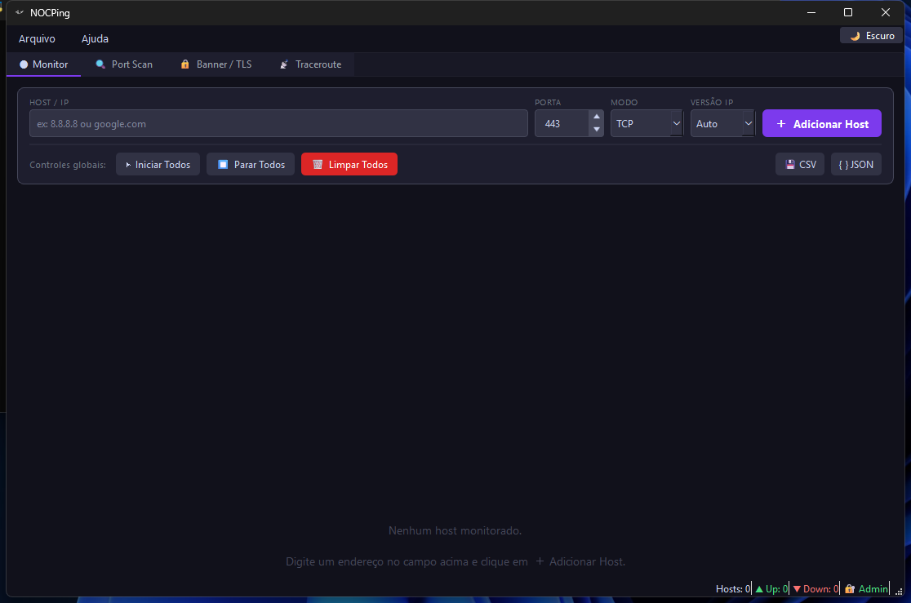
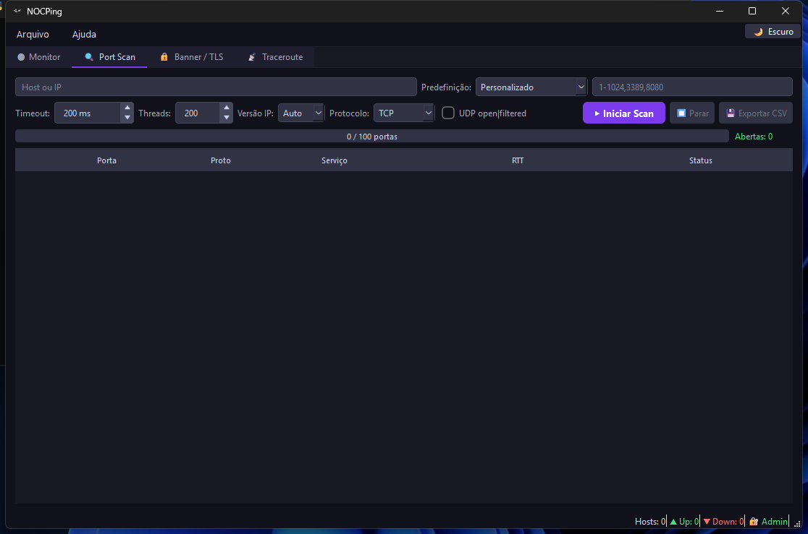
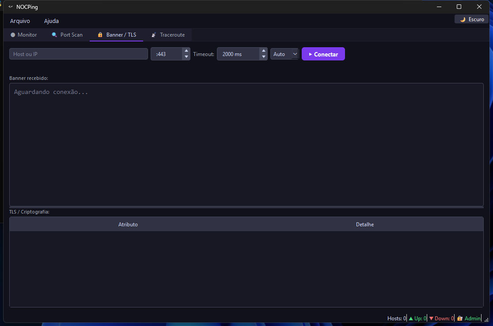
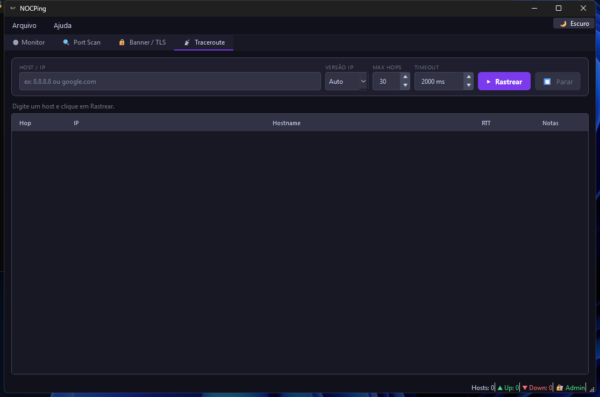
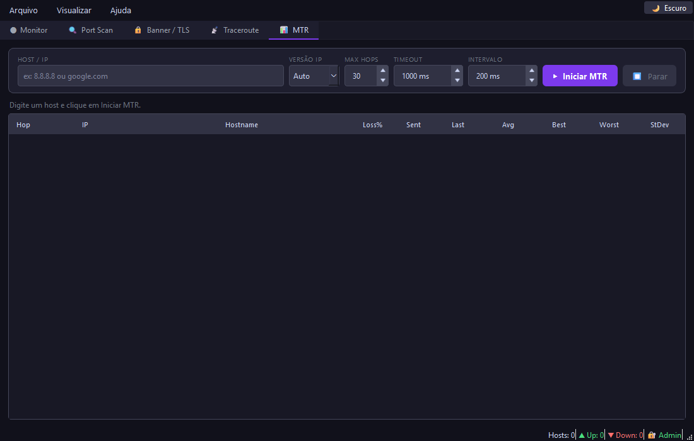

# NOCPing

Ferramenta de diagnóstico de rede para analistas NOC, desenvolvida em Python + PyQt6.


---

## Screenshots

### Monitor de Hosts

> Monitoramento em tempo real com gráfico de RTT, estatísticas e exportação CSV/JSON.

### Port Scan

> Varredura TCP/UDP com progresso em tempo real, presets e suporte a UDP open|filtered.

### Banner Grab / TLS

> Inspeção de banner HTTP e detalhes do certificado TLS/SSL.

### Traceroute

> Traceroute ICMP com resolução DNS reversa por hop.

### MTR — My TraceRoute

> Traceroute contínuo com estatísticas acumuladas por hop: loss%, sent, last/avg/best/worst/stdev RTT.

---

## Funcionalidades

| Aba | Recursos |
|-----|----------|
| **Monitor** | Multi-host TCP/ICMP/UDP, modo padrão ICMP, gráfico RTT, stats, exportar CSV/JSON, histórico SQLite por host, salva sessão |
| **Port Scan** | TCP+UDP, Top 20/100/All, progress bar, UDP open\|filtered, exportar CSV |
| **Banner/TLS** | Banner HTTP, versão TLS, cipher suite, CN e validade do certificado |
| **Traceroute** | ICMP TTL, DNS reverso com timeout 2s por hop, tabela Hop/IP/RTT, limpar e exportar CSV |
| **MTR** | Traceroute contínuo, estatísticas acumuladas por hop (loss%, avg, jitter), limpar e exportar CSV, requer admin |

### Outras funcionalidades

- **Notificações de sistema** — ícone na bandeja do sistema; alerta quando host fica OFFLINE ou volta ONLINE; toggle em `Visualizar → Notificações de host`
- **Histórico de RTT** — cada ping é persistido em SQLite local; botão "⏱ Histórico" em cada card exibe gráfico e tabela com exportação CSV
- **Screenshot integrado** — `Arquivo → Salvar Screenshot...` (`Ctrl+P`); funciona mesmo rodando como Administrador
- **Multi-janela** — `Ctrl+N` abre janelas adicionais com tema sincronizado
- **Tema claro / escuro** — detectado automaticamente via `darkdetect`; alternar em tempo real

---

## Changelog

### v1.2.0
- **Refatoração de Performance (100% otimizado)** — limite de 5000 registros na UI para evitar leak de memória; cálculo O(1) imediato de RTT stats na interface; correção de delay (6x mais rápido) em ciclos do Traceroute MTR.
- **Correções Críticas (Bugs)** — correção de `NameError` e duplo shutdown em instâncias multi-janela no macOS/Windows; SQLite ganha suporte robusto a transações em lote (batch commits) e fechamento limpo via modo WAL; correção do comportamento de fechamento, encerrando totalmente a aplicação em vez de minimizar para a bandeja.
- **Melhorias Visuais e UX** — Timeline em datas legíveis e reais (timestamp xAxis) no gráfico de Histórico; correção da cor do título dos cards baseados na paleta do tema (compatibilidade Dark/Light); alertas via bandeja do sistema para HostStatus.ERROR.
- **Startup mais rápido** — abas Scan/Banner/Traceroute/MTR inicializadas de forma lazy (só ao primeiro clique); janela abre antes dos hosts serem restaurados; `pyqtgraph` importado sob demanda; ícones do QSpinBox gerados em memória sem escrita em disco.
- **Monitor** — modo ICMP definido como padrão ao adicionar hosts.
- **Traceroute / MTR** — botões **Limpar** e **Exportar CSV** adicionados; correção de bug que misturava resultados de execuções consecutivas (worker anterior não era encerrado antes de iniciar novo).

### v1.1.0
- Aba MTR (My TraceRoute) com estatísticas contínuas por hop
- Histórico de RTT persistido em SQLite com gráfico e exportação CSV
- Notificações de bandeja quando host vai OFFLINE ou volta ONLINE
- Probes UDP específicos por porta (DNS, NTP, DHCP, NetBIOS, SNMP, mDNS)
- Screenshot integrado (`Ctrl+P`) — contorna restrição UIPI do Windows ao rodar como Admin

### v1.0.0
- Monitor multi-host TCP/ICMP/UDP com gráfico RTT em tempo real
- Port Scan TCP+UDP com asyncio (timeout confiável no Windows)
- Banner Grab + inspeção TLS/SSL
- Traceroute ICMP com DNS reverso por hop

---

## Download

Baixe o executável na página de [**Releases**](https://github.com/heitortpf/nocping/releases) — sem instalar Python ou dependências.

| Sistema | Arquivo |
|---------|---------|
| Windows 10/11 (64-bit) | `NOCPing-Windows.exe` |
| Linux (Ubuntu/Debian x64) | `NOCPing-Linux` |
| macOS 12+ (ARM/Intel) | `NOCPing-macOS` |

---

## Como usar

### Windows
1. Baixe `NOCPing-Windows.exe`
2. Clique duas vezes para abrir
3. Para ICMP, UDP e MTR: clique com botão direito → **Executar como administrador**

### Linux
```bash
chmod +x NOCPing-Linux
./NOCPing-Linux

# Para ICMP, UDP e MTR (requer root):
sudo ./NOCPing-Linux
```

### macOS
```bash
chmod +x NOCPing-macOS
# Primeira execução — liberar Gatekeeper:
xattr -cr NOCPing-macOS
./NOCPing-macOS

# Para ICMP, UDP e MTR (requer root):
sudo ./NOCPing-macOS
```

> **Nota:** TCP Port Scan funciona sem privilégios em todos os sistemas.

---

## Instalar via código-fonte

```bash
git clone https://github.com/heitortpf/nocping.git
cd nocping
pip install -r requirements.txt
python main.py
```

**Requisitos:**

| Dependência | Versão mínima |
|-------------|---------------|
| Python      | 3.11+         |
| PyQt6       | 6.6+          |
| pyqtgraph   | 0.13+         |
| darkdetect  | 0.8+          |

---

## Gerar o executável localmente

```bash
pip install pyinstaller
python -m PyInstaller --onefile --windowed --name NOCPing --icon NOCPing.ico --add-data "NOCPing.ico:." main.py
# Saída: dist/NOCPing.exe  (ou NOCPing no Linux/macOS)
```

---

## Testes

```bash
# CI-safe (sem rede ou admin):
pytest tests/ -v -m "not live"

# Completo (requer rede):
pytest tests/ -v
```

77 testes automatizados cobrindo `core/network`, `core/config_store`, `core/history_store`, `ui/widgets/_utils` e QThread workers.

---

## Estrutura do projeto

```
main.py                  — entry point
core/
  models.py              — dataclasses e enums
  network.py             — funções de rede puras
  workers.py             — QThread workers com sinais PyQt6
  config_store.py        — persistência da lista de hosts
  history_store.py       — histórico de RTT em SQLite
ui/
  main_window.py         — janela principal, temas, multi-janela, bandeja, screenshot
  monitor_tab.py         — aba de monitoramento
  scan_tab.py            — aba de port scan
  banner_tab.py          — aba de banner grab / TLS
  traceroute_tab.py      — aba de traceroute
  mtr_tab.py             — aba MTR (My TraceRoute)
  widgets/
    host_card.py         — card individual de host
    rtt_graph.py         — gráfico RTT em tempo real
    history_dialog.py    — diálogo de histórico RTT por host
    _utils.py            — helpers e estilos compartilhados
tests/
  test_network.py
  test_config_store.py
  test_history_store.py
  test_rtt_utils.py
  test_workers.py
```

---

## Licença

MIT
