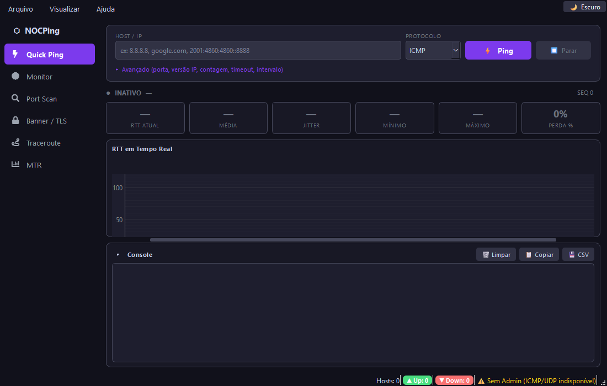
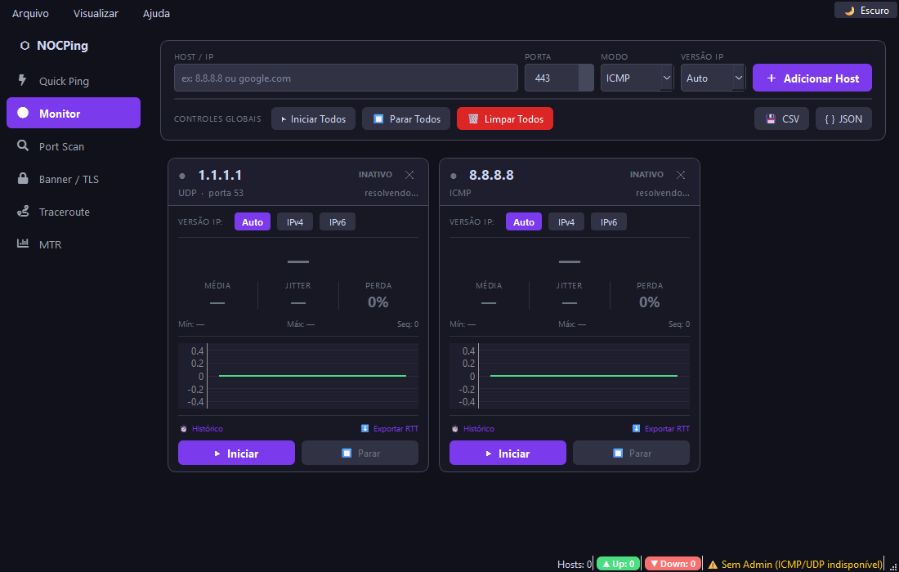
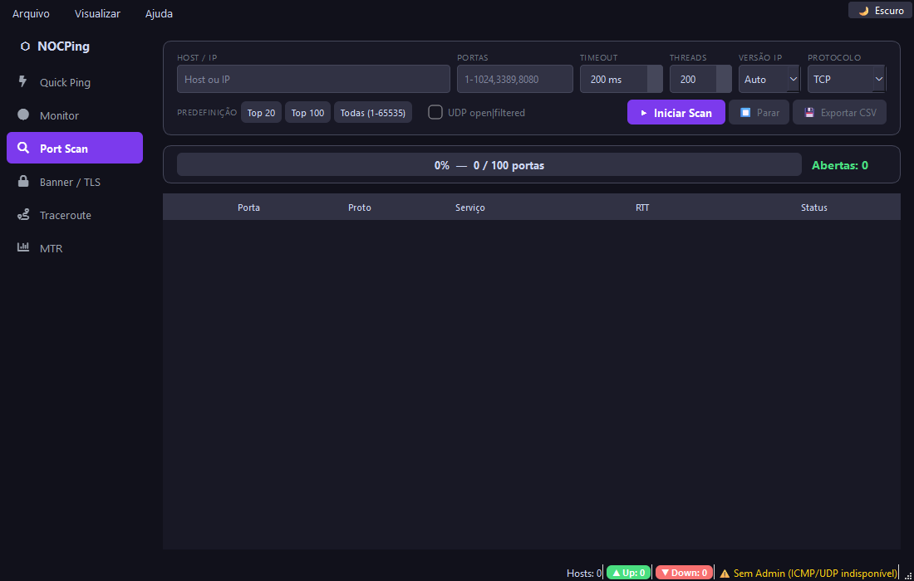
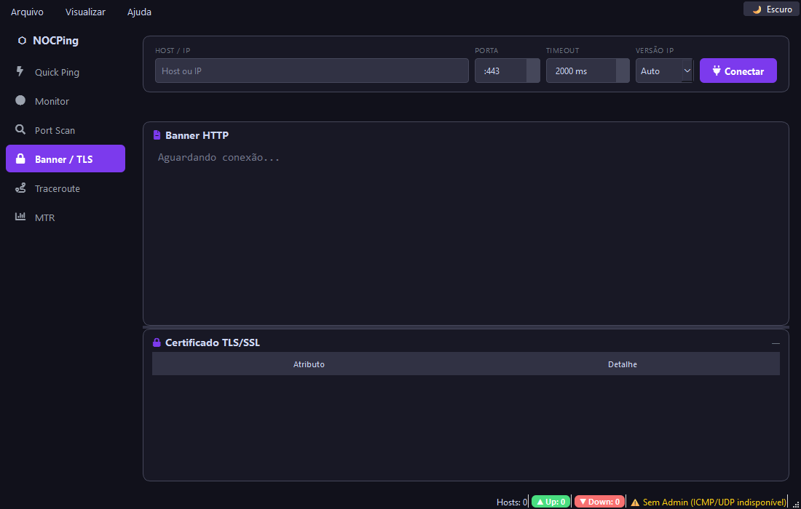
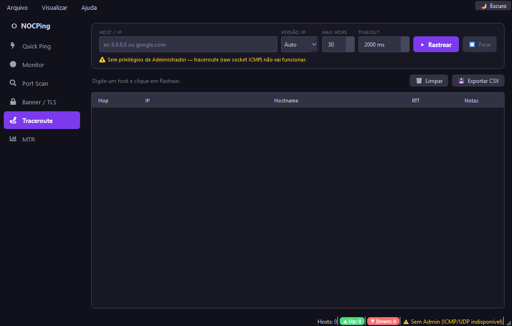
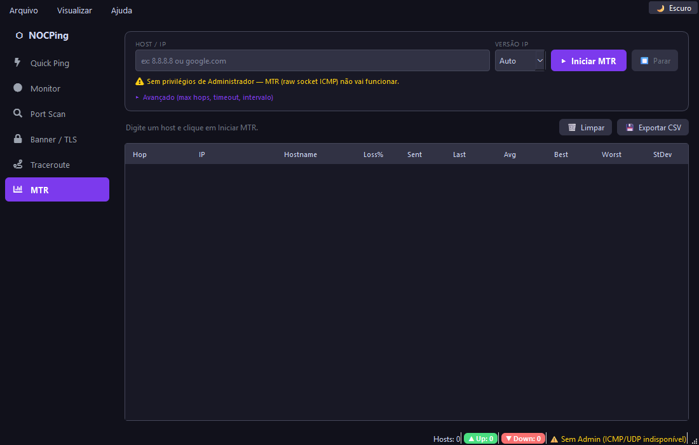

# NOCPing

Ferramenta de diagnóstico de rede para analistas NOC, desenvolvida em Python + PyQt6.


---

## Screenshots

> Capturadas com `python take_shots.py` (in-process, ver `docs/redesign/`) —
> `screenshots/dark/` e `screenshots/light/` têm o par completo dos dois temas
> para as 6 seções; abaixo só o tema escuro, como amostra.

### Quick Ping

> Tela inicial — ping rápido de host único (TCP/ICMP/UDP), gráfico RTT, console de log e stats em tempo real.

### Monitor de Hosts

> Monitoramento em tempo real com gráfico de RTT, estatísticas e exportação CSV/JSON.

### Port Scan

> Varredura TCP/UDP com progresso em tempo real, presets e suporte a UDP open|filtered.

### Banner Grab / TLS

> Inspeção de banner HTTP e detalhes do certificado TLS/SSL.

### Traceroute

> Traceroute ICMP com resolução DNS reversa por hop.

### MTR — My TraceRoute

> Traceroute contínuo com estatísticas acumuladas por hop: loss%, sent, last/avg/best/worst/stdev RTT.

---

## Funcionalidades

| Aba | Recursos |
|-----|----------|
| **Quick Ping** | (NOVO) Ping rápido de host único, TCP/ICMP/UDP, gráfico RTT expandido, log estilo console, stats completas (RTT, média, jitter, perda) |
| **Monitor** | Multi-host TCP/ICMP/UDP, modo padrão ICMP, gráfico RTT, stats, exportar CSV/JSON, histórico SQLite por host, salva sessão |
| **Port Scan** | TCP+UDP, Top 20/100/All, progress bar, UDP open\|filtered, exportar CSV |
| **Banner/TLS** | Banner HTTP, versão TLS, cipher suite, CN e validade do certificado |
| **Traceroute** | ICMP TTL, DNS reverso com timeout 2s por hop, tabela Hop/IP/RTT, limpar e exportar CSV |
| **MTR** | Traceroute contínuo, estatísticas acumuladas por hop (loss%, avg, jitter), limpar e exportar CSV, requer admin |

### Outras funcionalidades

- **Notificações de sistema** — ícone na bandeja do sistema; alerta sobre status de hosts (OFFLINE/ONLINE) no Monitor e Quick Ping, e notifica a conclusão de tarefas demoradas (Scan, Banner, Traceroute, MTR). Toggle em `Visualizar → Notificações de host`
- **Histórico de RTT** — cada ping é persistido em SQLite local; botão "⏱ Histórico" em cada card exibe gráfico e tabela com exportação CSV
- **Screenshot integrado** — `Arquivo → Salvar Screenshot...` (`Ctrl+P`); funciona mesmo rodando como Administrador
- **Multi-janela** — `Ctrl+N` abre janelas adicionais com tema sincronizado
- **Tema claro / escuro** — detectado automaticamente via `darkdetect`; alternar em tempo real

---

## Changelog

### v2.0.1
- **Fix: MTR/Traceroute só mostrava o salto final** — em instalações Windows
  onde a rede está classificada como "Pública", falta por padrão a regra de
  entrada do Firewall liberando ICMPv4 Time Exceeded (existe pra ICMPv6, não
  pra IPv4); sem ela, a resposta dos roteadores intermediários era
  descartada antes de chegar no raw socket, e só o Echo Reply do salto final
  (que tem regra própria) aparecia. `TracerouteWorker`/`MTRWorker` agora
  criam essa regra automaticamente via `netsh` assim que confirmam
  privilégio de Administrador (que essas telas já exigem pra rodar) — sem
  fricção nenhuma pro usuário, e falha sempre silenciosa se o `netsh` não
  puder rodar por algum motivo.
- **Fix: ícone da barra de tarefas genérico em algumas instalações Windows**
  — nem `QApplication.setWindowIcon()` nem `QWidget.setWindowIcon()` (os
  dois caminhos normais do Qt) garantiam o ícone certo pra janela **rodando**
  (diferente do atalho fixado, que extrai o ícone direto do `.exe` e sempre
  mostrava certo). `MainWindow` agora também define o ícone via `WM_SETICON`
  direto pela API do Windows como rede de segurança.
- **Documentação:** seção nova no README sobre o falso-positivo do Windows
  Defender em builds PyInstaller `--onefile` não assinados (não tem fix de
  código — é inerente a executável não assinado), com o procedimento de
  exclusão manual.
- Build: `--noupx` no PyInstaller (remove uma variável a mais de
  falso-positivo de antivírus; os runners do GitHub Actions já não tinham
  UPX instalado, então isto é sobretudo defensivo pra não depender disso no
  futuro).

### v2.0.0
- **Redesign visual completo** — novo design system (`ui/theme/tokens.py` +
  `ui/theme/components.py`): paleta, espaçamento, tipografia e componentes
  reutilizáveis (cards, botões, badges de status) centralizados numa única
  fonte de verdade, substituindo QSS inline duplicado entre abas. Todas as 6
  seções (Quick Ping, Monitor, Port Scan, Banner/TLS, Traceroute, MTR) foram
  redesenhadas em cima dele, com ícones via `qtawesome`.
- **Navegação por sidebar** — a barra de abas no topo (`QTabWidget`) foi
  substituída por uma sidebar vertical (`NavSidebar` + `QStackedWidget`),
  preservando lazy-loading (Scan/Banner/Traceroute/MTR só inicializam no
  primeiro clique), `Ctrl+N`, sincronização de tema entre janelas e o
  encerramento limpo do processo.
- **Refatoração estrutural** — `quick_ping_tab.py` foi quebrada em widgets
  dedicados (`quick_ping_control_panel.py`, `quick_ping_graph_panel.py`,
  `quick_ping_console.py`, `quick_ping_stats_panel.py`); a lógica de
  shutdown de worker, quase idêntica entre Scan/Banner/Traceroute/MTR, virou
  um mixin único (`WorkerTabMixin`); `main_window.py` ganhou
  `show_section()` como API única de navegação programática.
- **Otimizações de performance** — renderização do Port Scan em lotes
  (`QTimer` 10Hz, mesmo padrão do throttle do gráfico de RTT) com limite de
  5000 linhas na tabela ao vivo para o preset "Todas (1-65535)", que antes
  podia travar a UI por ~70s num scan UDP com muitas portas
  "open\|filtered" — CSV de exportação continua com o resultado completo,
  sem truncar. Ver `docs/PERFORMANCE.md` para a auditoria completa (profiling
  do Monitor com 50 hosts, confirmação do throttle de 10 FPS do `RttGraph`).
- **Testes de UI novos** — 33 testes com [pytest-qt](https://pytest-qt.readthedocs.io/)
  cobrindo navegação da sidebar + lazy-loading, troca de tema propagando pra
  todas as janelas abertas, e o contrato de cleanup do `WorkerTabMixin`
  (110 testes automatizados no total, era 77 na v1.5.0). CI
  (`.github/workflows/build.yml`) agora roda a suíte completa como gate
  antes de compilar/publicar qualquer release.
- **Fix: fechar uma janela secundária não derruba mais o app inteiro** —
  `MainWindow.closeEvent()` chamava `QApplication.quit()` incondicionalmente
  em qualquer janela; fechar uma janela aberta via `Ctrl+N` matava também a
  principal e todos os hosts sendo monitorados nela. Bug preexistente
  (anterior a esta sessão de redesign), encontrado no QA da v2.0.0. Agora
  cada janela limpa só os próprios workers ao fechar, e o processo só
  encerra de verdade quando a última janela fecha.
- **Quick Ping agora notifica também em ERROR, alinhado ao Monitor** — antes
  só alertava na bandeja para transições UP/DOWN; um erro de configuração/
  privilégio (ex.: ICMP/UDP sem Administrador) ficava só no console da aba,
  sem notificação, diferente do que o Monitor já fazia para o mesmo caso.

### v1.5.0
- **Notificações Globais de Sistema** — Notificações na bandeja do sistema para todas as abas. Receba alertas automáticos de conclusão ou erro ao finalizar tarefas como Port Scan, Traceroute, Banner Grab, MTR e Quick Ping. A aba Quick Ping agora também conta com alertas ao vivo de queda ou retorno de host (UP/DOWN) durante execuções prolongadas.

### v1.4.0
- **Otimização de Performance Extrema (Zero Stuttering)** — O gargalo do banco de dados SQLite foi isolado em uma Thread Assíncrona (`queue.Queue()`), acabando com os travamentos da UI causados por contenção de locks (`_rw_lock`). Adição de Limitador de Taxa de Renderização (Throttling) nos gráficos RTT, que agora atualizam a um máximo de 10 FPS e consomem 0% de CPU em abas escondidas. O painel Monitor agora aguenta dezenas de hosts sem perda de fluidez.

### v1.3.0
- **Quick Ping (Nova Aba Inicial)** — Diagnóstico ágil de um único host. Conta com gráfico RTT expandido, console de log integrado com auto-scroll e cópia, suporte a TCP/ICMP/UDP, e estatísticas em tempo real (RTT, Média, Jitter, Mínimo, Máximo, Perda).
- **Fix: Botão Parar e reinício automático** — Corrigida race condition de sinais que impedia o botão Parar de funcionar; ao iniciar novo ping, o anterior é parado automaticamente, o console é limpo e o novo teste inicia (comportamento consistente com as demais abas).

### v1.2.0
- **Refatoração de Performance (100% otimizado)** — limite de 5000 registros na UI para evitar leak de memória; cálculo O(1) imediato de RTT stats na interface; correção de delay (6x mais rápido) em ciclos do Traceroute MTR.
- **Correções Críticas (Bugs)** — correção de `NameError` e duplo shutdown em instâncias multi-janela no macOS/Windows; SQLite ganha suporte robusto a transações em lote (batch commits) e fechamento limpo via modo WAL; correção do comportamento de fechamento, encerrando totalmente a aplicação em vez de minimizar para a bandeja.
- **Melhorias Visuais e UX** — Timeline em datas legíveis e reais (timestamp xAxis) no gráfico de Histórico; correção da cor do título dos cards baseados na paleta do tema (compatibilidade Dark/Light); alertas via bandeja do sistema para HostStatus.ERROR.
- **Startup mais rápido** — abas Scan/Banner/Traceroute/MTR inicializadas de forma lazy (só ao primeiro clique); janela abre antes dos hosts serem restaurados; `pyqtgraph` importado sob demanda; ícones do QSpinBox gerados em memória sem escrita em disco.
- **Monitor** — modo ICMP definido como padrão ao adicionar hosts.
- **Traceroute / MTR** — botões **Limpar** e **Exportar CSV** adicionados; correção de bug que misturava resultados de execuções consecutivas (worker anterior não era encerrado antes de iniciar novo).

### v1.1.0
- Aba MTR (My TraceRoute) com estatísticas contínuas por hop
- Histórico de RTT persistido em SQLite com gráfico e exportação CSV
- Notificações de bandeja quando host vai OFFLINE ou volta ONLINE
- Probes UDP específicos por porta (DNS, NTP, DHCP, NetBIOS, SNMP, mDNS)
- Screenshot integrado (`Ctrl+P`) — contorna restrição UIPI do Windows ao rodar como Admin

### v1.0.0
- Monitor multi-host TCP/ICMP/UDP com gráfico RTT em tempo real
- Port Scan TCP+UDP com asyncio (timeout confiável no Windows)
- Banner Grab + inspeção TLS/SSL
- Traceroute ICMP com DNS reverso por hop

---

## Download

Baixe o executável na página de [**Releases**](https://github.com/heitortpf/nocping/releases) — sem instalar Python ou dependências.

| Sistema | Arquivo |
|---------|---------|
| Windows 10/11 (64-bit) | `NOCPing-Windows.exe` |
| Linux (Ubuntu/Debian x64) | `NOCPing-Linux` |
| macOS 12+ (ARM/Intel) | `NOCPing-macOS` |

---

## Como usar

### Windows
1. Baixe `NOCPing-Windows.exe`
2. Clique duas vezes para abrir
3. Para ICMP, UDP e MTR: clique com botão direito → **Executar como administrador**

### Linux
```bash
chmod +x NOCPing-Linux
./NOCPing-Linux

# Para ICMP, UDP e MTR (requer root):
sudo ./NOCPing-Linux
```

### macOS
```bash
chmod +x NOCPing-macOS
# Primeira execução — liberar Gatekeeper:
xattr -cr NOCPing-macOS
./NOCPing-macOS

# Para ICMP, UDP e MTR (requer root):
sudo ./NOCPing-macOS
```

> **Nota:** TCP Port Scan funciona sem privilégios em todos os sistemas.

### ⚠ Windows Defender / SmartScreen marcando como vírus

`NOCPing-Windows.exe` é um executável **não assinado digitalmente** gerado
pelo PyInstaller em modo `--onefile` (ele se auto-extrai numa pasta temporária
ao rodar — um padrão de comportamento que os heurísticos de antivírus
associam a malware). É um falso-positivo extremamente comum em qualquer
projeto Python empacotado dessa forma, não algo específico do NOCPing.

Se o Windows colocar o `.exe` em quarentena ao baixar:

1. Abra **Segurança do Windows → Proteção contra vírus e ameaças → Proteção
   contra vírus e ameaças → Gerenciar configurações → Adicionar ou remover
   exclusões → Adicionar uma exclusão → Arquivo**, e aponte para o
   `NOCPing-Windows.exe` baixado (ou numa janela **PowerShell como
   Administrador**):
   ```powershell
   Add-MpPreference -ExclusionPath "$env:USERPROFILE\Downloads\NOCPing-Windows.exe"
   ```
2. Restaure o arquivo da quarentena (**Histórico de proteção** na mesma tela).
3. Opcional: [reporte como falso-positivo pra Microsoft](https://www.microsoft.com/en-us/wdsi/filesubmission) — não resolve na hora, mas ajuda a limpar a detecção nas definições futuras de todo mundo.

### ⚠ MTR/Traceroute só mostra o salto final ("* * *" nos saltos intermediários)

Não é bug do NOCPing — é uma regra de entrada que falta no **Firewall do
Windows** quando a rede está classificada como **Pública** (comum ao
conectar numa Wi-Fi/rede nova pela primeira vez). O Windows tem, por padrão,
uma regra de entrada liberando **ICMPv6** Time Exceeded, mas **não** a
equivalente pra **ICMPv4** (tipo 11) — então qualquer ferramenta que manda
ICMP por raw socket (inclusive o NOCPing) tem a resposta dos roteadores
intermediários descartada pelo firewall antes de chegar no app. O `tracert`
nativo do Windows não é afetado porque usa a API interna `ICMP.SYS`, que não
passa pela mesma avaliação de regras.

**Diagnóstico:** `Get-NetFirewallRule -Direction Inbound | Where DisplayName -match "ICMP"`
— se não tiver nenhuma regra de entrada pra `ICMPv4`/tipo `11` habilitada
pro perfil da sua rede, é isso.

**Fix**, numa janela **PowerShell como Administrador**:
```powershell
New-NetFirewallRule -DisplayName "ICMPv4 Time Exceeded (Entrada)" -Direction Inbound -Protocol ICMPv4 -IcmpType 11 -Action Allow -Profile Any
```

---

## Instalar via código-fonte

```bash
git clone https://github.com/heitortpf/nocping.git
cd nocping
pip install -r requirements.txt
python main.py
```

**Requisitos:**

| Dependência | Versão mínima |
|-------------|---------------|
| Python      | 3.11+         |
| PyQt6       | 6.6+          |
| pyqtgraph   | 0.13+         |
| darkdetect  | 0.8+          |

---

## Gerar o executável localmente

```bash
pip install pyinstaller
python -m PyInstaller --onefile --windowed --noupx --name NOCPing --icon NOCPing.ico --collect-data qtawesome --add-data "NOCPing.ico:." main.py
# Saída: dist/NOCPing.exe  (ou NOCPing no Linux/macOS)
```

---

## Testes

```bash
# CI-safe (sem rede ou admin):
pytest tests/ -v -m "not live"

# Completo (requer rede):
pytest tests/ -v
```

110 testes automatizados: `core/network`, `core/config_store`, `core/history_store`,
`ui/widgets/_utils` e QThread workers (77), mais cobertura de UI via
[pytest-qt](https://pytest-qt.readthedocs.io/) (33) — navegação da sidebar e
lazy-loading das abas Scan/Banner/Traceroute/MTR (`test_ui_navigation.py`),
troca de tema claro/escuro (`test_ui_theme.py`) e o cleanup de workers do
`WorkerTabMixin` (`test_worker_tab_mixin.py`).

### Testes de UI (pytest-qt)

Os testes que usam o fixture `qtbot` (`test_ui_navigation.py`, `test_ui_theme.py`)
instanciam janelas Qt de verdade e **precisam de um display** — não rodam
"headless" por padrão. Localmente (Windows/macOS/Linux com sessão gráfica)
não é preciso nada além de `pip install -r requirements.txt`; os testes já
rodam junto com `pytest tests/ -v -m "not live"`.

Em CI Linux (ou qualquer ambiente sem display, ex. servidor sem GUI), rode
sob um X server virtual com [xvfb](https://www.x.org/releases/X11R7.6/doc/man/man1/Xvfb.1.xhtml):

```bash
# Debian/Ubuntu
sudo apt-get install -y xvfb
xvfb-run -a pytest tests/ -v -m "not live"

# ou manualmente, numa sessão separada:
Xvfb :99 -screen 0 1280x800x24 &
export DISPLAY=:99
pytest tests/ -v -m "not live"
```

Windows e macOS têm um servidor de display sempre disponível (mesmo em
runner de CI headless o Qt usa o compositor nativo), então `xvfb-run` só é
necessário no Linux.

### Regressão visual

`scripts/visual_regression.py` roda `take_shots.py` e compara as capturas
pixel a pixel contra um diretório de baseline, com tolerância configurável:

```bash
python scripts/visual_regression.py --baseline-dir docs/redesign/screenshots-post
```

Não é um teste `pytest` (não roda junto com a suíte) — é uma ferramenta
separada para detectar regressões visuais entre uma sessão de trabalho e a
próxima. Requer display pela mesma razão dos testes de UI acima.

---

## Estrutura do projeto

```
main.py                  — entry point
core/
  models.py              — dataclasses e enums
  network.py             — funções de rede puras
  workers.py             — QThread workers com sinais PyQt6
  config_store.py        — persistência da lista de hosts
  history_store.py       — histórico de RTT em SQLite
ui/
  main_window.py         — janela principal, temas, multi-janela, bandeja, screenshot
  quick_ping_tab.py      — aba de ping rápido (host único)
  monitor_tab.py         — aba de monitoramento
  scan_tab.py            — aba de port scan
  banner_tab.py          — aba de banner grab / TLS
  traceroute_tab.py      — aba de traceroute
  mtr_tab.py             — aba MTR (My TraceRoute)
  widgets/
    host_card.py         — card individual de host
    rtt_graph.py         — gráfico RTT em tempo real
    history_dialog.py    — diálogo de histórico RTT por host
    _utils.py            — helpers e estilos compartilhados
tests/
  test_network.py
  test_config_store.py
  test_history_store.py
  test_rtt_utils.py
  test_workers.py
  test_ui_navigation.py   — sidebar + lazy-loading das abas (pytest-qt)
  test_ui_theme.py        — troca de tema claro/escuro (pytest-qt)
  test_worker_tab_mixin.py — cleanup de workers (WorkerTabMixin)
scripts/
  visual_regression.py    — diff pixel a pixel de screenshots contra um baseline
```

---

## Licença

MIT
